# App design guide

These are reference layouts for planning an app's pages before writing any
code. They are not built into the firmware. An app draws its cards at run time
from the numbers in [`wasp/cards.py`](../wasp/cards.py) with
`Draw565.rounded_rect`, as described in [`card-layout.md`](card-layout.md).
Use the drawings here to choose a layout, then reproduce it with `cards.size`
and `cards.edges`.

## The screen

| Property | Value |
| --- | --- |
| Screen | 240 x 240 pixels |
| Margin around the edge | 4 px |
| Gap between cards | 4 px in these drawings; `cards.edges` never goes below 3 |
| Corner radius | 12 px, the default `radius` of `rounded_rect` |
| Scroll bar | 2 px wide at x = 238, so cards stop at x = 236 |

Each drawing is an Inkscape document 63.5 mm square, which is 240 px, so 1 px
is 0.2646 mm. The guides are locked to the screen edge; keep them that way
when drawing a new layout.

## Colours

| Role | Colour | In code |
| --- | --- | --- |
| Background | Black `#000000` | `0` |
| Card | Dark grey `#313031` | `cards.COLOR` (`0x3186`) |
| Text and symbolic icons | White `#FFFFFF` | `wasp.system.theme('bright')` |
| Secondary text, an option that is off | Grey | `wasp.system.theme('mid')` |
| Accent: selection, a toggle that is on | Blue, `#393CFF` by default | `wasp.system.theme('ui')` (`0x39ff`) |

The drawings fill their cards with a mid grey, `#808080`, so the tiles stand
out on a monitor. Do not copy that grey into an app.

The accent is the one colour a user may change, so read it from the theme
rather than writing a value into an app. The proposed default accent is
`#00ACFF`, which is `0x055f` in RGB565; the theme still ships `0x39ff`.
Everything else stays fixed: black behind, grey cards, white content.

## Layouts

Names give rows by columns for the regular grids. The lettered layouts mix a
large card with a row of small ones.

| Layout | Cards | Drawing | Good for |
| --- | --- | --- | --- |
| `1x1` | One full card | 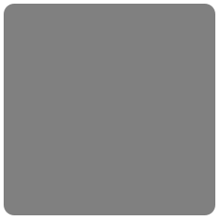 | A single reading or a large control, such as a timer face |
| `2x1` | Two stacked cards | 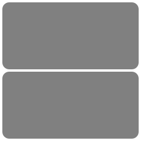 | A question with two answers, a value above its control |
| `2x2` | Four large tiles | 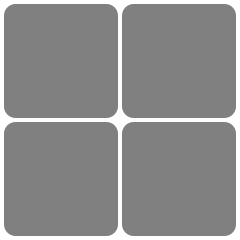 | Four main actions |
| `3x1` | Three stacked rows | 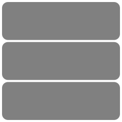 | A short list with room for two lines a row |
| `3x2` | Six tiles in three columns | 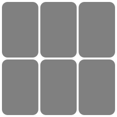 | A small menu of icons |
| `3x3` | Nine tiles | 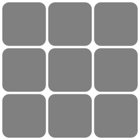 | An icon grid; the grid launcher uses it |
| `4x1` | Four stacked rows | 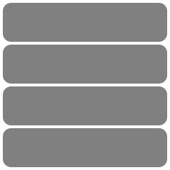 | A list of name and icon; the list launcher and the alarm list use it |
| `4x2` | Eight tiles in two columns | 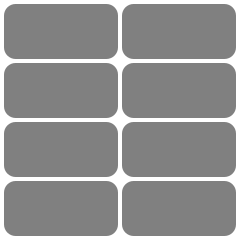 | Paired values or short labels; the alarm time editor uses it |
| `2x4` | Eight tall tiles | 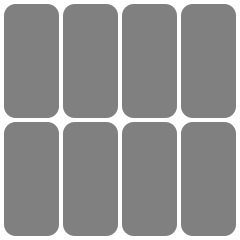 | Narrow toggles or a keypad row |
| `2x4-7` | Seven tall tiles | 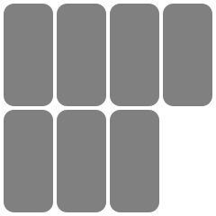 | The days of the week; the alarm day picker uses it |
| `a` | A wide card over two tiles | 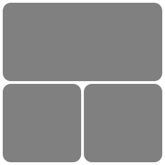 | A value with two actions under it |
| `b` | A wide card over three tiles | 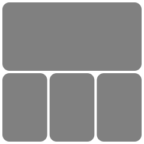 | A value with three actions under it |
| `c` | A tall card over two tiles | 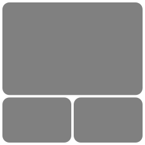 | A summary with Delete and Save; the alarm summary uses it |
| `d` | A tall card over three tiles | 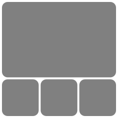 | A summary with three actions |

## Principles

- **One task a page.** A page should answer one question or hold one control
  group. Split a busy page across several, paged vertically.
- **Cards are touch targets.** A card is the area a finger hits, so make it
  the whole control. No card here is narrower than 55 px on its short side.
- **Page vertically.** Swipe up and down to move between pages, and leave left
  and right for the system. The panel can scroll vertically in hardware, so a
  vertical layout is the one that can animate.
- **White on grey.** Content goes in white on the card grey. Use `mid` for
  what is secondary or off, and keep the accent for what is selected or on.
- **Fill to show selection.** Mark a selected card by filling it with the
  accent, not with a bar or an outline. `rounded_rect` keeps the corners.
- **Draw cards, do not store them.** Each of these drawings baked into a
  bitmap costs 0.5 to 1.6 KB of flash, and every new arrangement needs another.
  The same page drawn from `cards.py` costs a few numbers.
- **Use symbolic icons.** Icons are single-colour Font Awesome glyphs from
  [`tools/gen_app_icons.py`](../tools/gen_app_icons.py), so the app can colour
  them to match their state.
